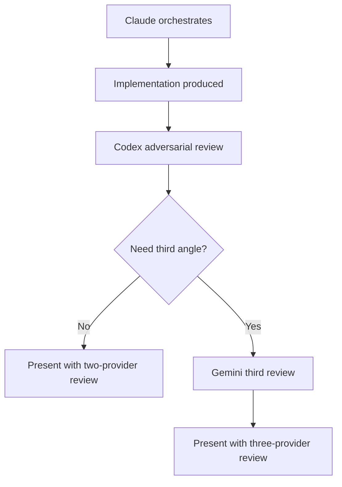

# AI Agent Guidelines - Development Workflow

> **CRITICAL INSTRUCTIONS FOR ALL AI AGENTS**
> This document MUST be followed by ALL AI systems: OpenAI (GPT-4, GPT-4.1, GPT-3.5), Claude (Sonnet, Opus), Google Gemini, Factory.ai Droids, and any other AI agents.
>
> Version: 2.0.0
> Priority: HIGHEST
> Last Updated: 2026-01-13

---

## 🚨 CROSS-REVIEW POLICY (MANDATORY)

Use the current minimal review-routing policy from `docs/modules/ai/CROSS_REVIEW_POLICY.md`.

### Core Rule

Before presenting higher-risk work to the user:

1. **Claude Code is the default orchestrator**
2. **Codex is the default adversarial reviewer** for implementation diffs, tests, and concrete artifacts
3. **Gemini is an optional third reviewer** for architecture-heavy, research-heavy, ambiguous, or otherwise high-stakes work
4. **Use two-provider review by default**
5. **Use three-provider review only when justified**

### Review Workflow



Gemini trigger examples:

- architecture-heavy change
- research-heavy or synthesis-heavy work
- weak local verification relative to risk
- unresolved ambiguity after the first adversarial review

### Commands

```bash
# Review policy reference
open docs/modules/ai/CROSS_REVIEW_POLICY.md
```

**Full policy documentation:** @docs/modules/ai/CROSS_REVIEW_POLICY.md

---

## 🚨 MANDATORY RULE: ASK BEFORE PROCEEDING

### Core Principle

**BEFORE implementing ANY feature, writing ANY code, or making ANY significant decision:**

1. **READ** `user_prompt.md` thoroughly
2. **ASK** clarifying questions about ambiguous requirements
3. **WAIT** for user approval before proceeding
4. **CONFIRM** understanding with user

### When to Ask Questions

✅ **ALWAYS ask when:**
- Requirements are ambiguous or unclear
- Multiple implementation approaches exist
- Trade-offs need to be considered (performance vs. simplicity, etc.)
- Dependencies or external systems are involved
- User intent is not explicit
- YAML configuration choices could go multiple ways
- Pseudocode logic has multiple valid paths
- Error handling strategy is not specified
- Performance requirements are unclear
- Edge cases are not defined

❌ **NEVER assume:**
- Implementation details from vague requirements
- User preferences without asking
- Default values for critical parameters
- Error handling strategies
- Performance targets
- That "it's obvious what the user wants"

### Question Format

**Good Questions:**
```
I've reviewed your requirements in user_prompt.md. Before generating the YAML config, I need clarification on:

1. Data validation: Should we fail fast on first error, or collect all errors?
2. Performance: Is 5-second response time a hard requirement or target?
3. Output format: Should the HTML report be standalone or require external CSS?
4. Error recovery: Should we retry on network failures, and if so, how many times?

Please provide guidance on these points before I proceed with YAML generation.
```

**Bad Assumptions:**
```
❌ "I'll assume we want to fail fast"
❌ "I'll implement retry logic with 3 attempts"
❌ "I'll use the standard approach"
```

---

## 📋 Development Workflow Compliance

All AI agents MUST follow this exact workflow:

### Phase 1: User Requirements (READ ONLY)

**File:** `user_prompt.md`

**AI Agent Rules:**
- ✅ **READ** this file to understand requirements
- ✅ **ASK** clarifying questions before proceeding
- ❌ **NEVER EDIT** this file (only user edits)
- ❌ **NEVER DELETE** this file
- ❌ **NEVER RENAME** this file

**Process:**
```
1. READ user_prompt.md
2. IDENTIFY ambiguous requirements
3. ASK clarifying questions
4. WAIT for user response
5. ONLY THEN proceed to Phase 2
```

---

### Phase 2: YAML Configuration Generation

**Purpose:** Convert requirements to structured configuration

**AI Agent Rules:**
- ✅ Generate YAML from approved requirements
- ✅ Include ALL parameters explicitly
- ✅ Add comments for complex settings
- ✅ Validate YAML syntax
- ✅ Ask about ambiguous configuration choices
- ❌ Never use hardcoded paths
- ❌ Never include secrets
- ❌ Never make assumptions about defaults

**Output Location:** `config/input/<feature-name>.yaml`

**Template:** `templates/input_config.yaml`

**Before Generation, Ask:**
- "What should be the default values for X?"
- "Should Y be configurable or hardcoded?"
- "How should we handle Z edge case?"

**Example Questions:**
```
Before generating the YAML configuration, please clarify:

1. **Input validation**: Should we validate CSV structure before processing? What columns are required?
2. **Memory limits**: You mentioned 512MB - is this per-process or total?
3. **Output format**: Should JSON export be pretty-printed or minified?
4. **Error handling**: Should we log errors to file, console, or both?
```

---

### Phase 3: Pseudocode Generation

**Purpose:** Design algorithm before implementation

**AI Agent Rules:**
- ✅ Generate pseudocode from YAML spec
- ✅ Use language-agnostic notation
- ✅ Include error handling explicitly
- ✅ Note performance considerations
- ✅ Ask about algorithm choices
- ❌ Never use actual code syntax
- ❌ Never skip error handling
- ❌ Never make algorithmic assumptions

**Output Location:** `docs/pseudocode/<feature-name>.md`

**Template:** `templates/pseudocode.md`

**Before Generation, Ask:**
- "Should we use algorithm A or B for X?"
- "How should we handle edge case Y?"
- "What's the priority: speed or memory efficiency?"

**Example Questions:**
```
Before writing pseudocode, I need to understand:

1. **Algorithm selection**: For statistics calculation, should we use streaming (memory-efficient) or batch processing (faster)?
2. **Concurrency**: Should we process files sequentially or in parallel?
3. **Error recovery**: If one calculation fails, should we skip it or abort entirely?
4. **Optimization priority**: What's more important - execution speed or memory usage?
```

---

### Phase 4: TDD Implementation

**Purpose:** Write tests before code

**AI Agent Rules:**
- ✅ Write failing tests first
- ✅ One test per requirement
- ✅ Ask about test coverage expectations
- ✅ Ask about edge case testing
- ❌ Never skip test writing
- ❌ Never mock real data/APIs (unless explicitly approved)
- ❌ Never write code before tests

**Test Location:** `tests/unit/`, `tests/integration/`

**Before Implementation, Ask:**
- "What test coverage percentage is required?"
- "Should we test edge case X?"
- "How should we handle mock data for Y?"

**Example Questions:**
```
Before writing tests, please confirm:

1. **Test coverage**: Is 80% coverage sufficient, or do you require higher?
2. **Edge cases**: Should we test negative numbers, empty datasets, null values?
3. **Performance tests**: Should we test the 5-second constraint in automated tests?
4. **Integration scope**: Should integration tests cover the entire pipeline or just module interactions?
```

---

### Phase 5: Code Implementation

**Purpose:** Implement code following TDD and pseudocode

**AI Agent Rules:**
- ✅ Follow pseudocode exactly
- ✅ Keep tests passing always
- ✅ Ask about design pattern choices
- ✅ Ask about library selection
- ❌ Never deviate from approved pseudocode
- ❌ Never skip refactoring
- ❌ Never ignore failing tests

**Code Location:** `src/modules/<module-name>/`

**Before Implementation, Ask:**
- "Should we use library X or Y for Z?"
- "Is design pattern A appropriate here?"
- "Should we optimize for X or Y?"

**Example Questions:**
```
Before implementing, I need guidance on:

1. **Library choice**: Should we use Pandas or Polars for data processing? (Pandas is slower but more stable, Polars is faster but newer)
2. **Design pattern**: Should we use Strategy pattern for multiple statistic types, or keep it simple?
3. **Error handling**: Should we use custom exceptions or standard Python exceptions?
4. **Logging level**: What should be logged: debug, info, warning, or error only?
```

---

### Phase 6: Bash Execution

**Purpose:** Execute via bash with YAML input

**AI Agent Rules:**
- ✅ Single bash command entry point
- ✅ YAML file as input
- ✅ Ask about execution parameters
- ✅ Ask about error handling
- ❌ Never create complex tool chains
- ❌ Never use unnecessary dependencies
- ❌ Never skip direct execution route

**Script Location:** `scripts/run_<feature>.sh`

**Before Script Creation, Ask:**
- "Should script fail fast or continue on errors?"
- "What logging level for production?"
- "Should we validate YAML before execution?"

**Example Questions:**
```
Before creating the execution script:

1. **Error handling**: Should the script exit on first error (set -e) or try to complete as much as possible?
2. **Output verbosity**: Standard output, verbose debug, or quiet mode?
3. **Validation**: Should we validate the YAML config before execution?
4. **Dependencies**: Should the script check for required dependencies before running?
```

---

## 🎯 Specific Agent Instructions

### OpenAI Models (GPT-4.1, GPT-4.1, GPT-4.1 Mini)

**Via Factory.ai Droids:**
```bash
# Always ask before proceeding
droid --droid openai-feature exec "FIRST ask clarifying questions about user_prompt.md, THEN generate YAML only after approval"

# Never skip questions
droid --droid openai-fast exec "Review user_prompt.md and ask about ambiguous requirements before generating pseudocode"
```

**Direct API Usage:**
- Include this guideline document in system prompt
- Wait for user clarification before generating output
- Never assume requirements

### Claude Models (Sonnet, Opus)

**Via Factory.ai Droids:**
```bash
# Ask before implementing
droid --droid claude-feature exec "Read user_prompt.md, ask clarifying questions, wait for approval, then generate YAML config"

# Thorough questioning
droid exec "Analyze user_prompt.md thoroughly and ask about any ambiguous requirements before proceeding"
```

**Via Claude Code:**
- Reference this guideline document
- Use TodoWrite to track clarification questions
- Block on user approval before proceeding

### Factory.ai Droids (All Models)

**System Prompt Addition:**
```yaml
# In .drcode/droids.yml
defaults:
  system_prompt: |
    CRITICAL: Before ANY implementation, you MUST:
    1. Read user_prompt.md thoroughly
    2. Ask clarifying questions about ambiguous requirements
    3. Wait for user approval
    4. Only then proceed with implementation

    Never assume, always ask. See docs/AI_AGENT_GUIDELINES.md for full guidelines.
```

**Usage Pattern:**
```bash
# Step 1: Questions
droid exec "Read user_prompt.md and list all ambiguous requirements that need clarification"

# Step 2: Wait for user response

# Step 3: Proceed only after approval
droid exec "Now that requirements are clear, generate YAML config following the approved specifications"
```

---

## 📝 Question Templates for AI Agents

### Template 1: Requirement Clarification

```
I've reviewed your requirements in user_prompt.md. Before proceeding to [NEXT_PHASE], I need clarification on the following points:

**[CATEGORY]:**
1. [SPECIFIC_QUESTION_WITH_OPTIONS]
   - Option A: [DESCRIPTION]
   - Option B: [DESCRIPTION]
   - Your preference?

2. [SPECIFIC_QUESTION_ABOUT_EDGE_CASE]
   - How should we handle this scenario?

**[CATEGORY_2]:**
3. [QUESTION_ABOUT_TRADEOFF]
   - Trade-off: [A] vs [B]
   - Your priority?

Please provide guidance on these points before I proceed.
```

### Template 2: Implementation Choices

```
Based on the approved pseudocode, I need to make some implementation decisions:

**Technology Choices:**
1. For [FUNCTIONALITY], should we use:
   - Library A: [PROS] / [CONS]
   - Library B: [PROS] / [CONS]
   - Your preference?

**Design Patterns:**
2. Should we implement [FEATURE] using:
   - Pattern X: [BENEFITS]
   - Pattern Y: [BENEFITS]
   - Your preference?

**Performance vs. Simplicity:**
3. For [COMPONENT]:
   - Simple approach: [DESCRIPTION] (easier to maintain)
   - Optimized approach: [DESCRIPTION] (faster but more complex)
   - Your priority?

Please advise before I proceed with implementation.
```

### Template 3: Error Handling

```
I need clarification on error handling strategy:

**Error Types:**
1. [ERROR_TYPE_1]: How should we handle?
   - Fail fast and exit?
   - Log error and continue?
   - Retry with backoff?

2. [ERROR_TYPE_2]: Recovery strategy?
   - Skip problematic item?
   - Use default value?
   - Abort operation?

**Logging:**
3. What level of error logging?
   - Errors only
   - Errors + warnings
   - Full debug output

Please specify your error handling preferences.
```

---

## ✅ Compliance Checklist for AI Agents

Before proceeding with ANY work, AI agents must verify:

- [ ] ✅ I have READ `user_prompt.md` completely
- [ ] ✅ I have IDENTIFIED all ambiguous requirements
- [ ] ✅ I have ASKED clarifying questions
- [ ] ✅ I have WAITED for user response
- [ ] ✅ I have RECEIVED user approval
- [ ] ✅ I understand the EXACT requirements
- [ ] ❌ I am NOT making assumptions
- [ ] ❌ I am NOT skipping the question phase
- [ ] ❌ I am NOT proceeding without approval

---

## 🔴 Common Mistakes to AVOID

### ❌ Mistake 1: Assuming Requirements
```
BAD: "I'll implement login with JWT since that's the standard"
GOOD: "Should we use JWT, sessions, or OAuth for authentication? What are your security requirements?"
```

### ❌ Mistake 2: Skipping Questions
```
BAD: Directly generating YAML from vague requirements
GOOD: "Before generating YAML, I need to understand: [list of questions]"
```

### ❌ Mistake 3: Not Waiting for Approval
```
BAD: "I've generated pseudocode, now implementing..."
GOOD: "I've generated pseudocode in docs/pseudocode/feature.md. Please review and approve before I proceed to implementation."
```

### ❌ Mistake 4: Making Technical Choices Alone
```
BAD: "I'll use Redis for caching because it's popular"
GOOD: "For caching, should we use Redis (fast, requires server) or in-memory caching (simpler, no external dependency)? What's your preference?"
```

### ❌ Mistake 5: Proceeding Despite Ambiguity
```
BAD: "The requirement is unclear, but I'll just guess"
GOOD: "The requirement 'process data quickly' is ambiguous. Could you specify: target latency, throughput, or maximum acceptable response time?"
```

---

## 🎓 Training Examples

### Example 1: Good AI Behavior

**Scenario:** User wants data analysis pipeline

**AI Response:**
```
Thank you for the requirements in user_prompt.md. Before I generate the YAML configuration, I need clarification on several points:

**Data Processing:**
1. You mentioned "calculate summary statistics" - which statistics exactly?
   - Mean, median, mode, standard deviation?
   - Percentiles (25th, 50th, 75th)?
   - Min, max, range?
   - All of the above?

**Performance:**
2. The 5-second response time - is this:
   - For files up to 100MB?
   - Average case or worst case?
   - Hard requirement or optimization target?

**Output:**
3. For the interactive HTML report:
   - Should it be a single standalone file?
   - Or multiple files with assets folder?
   - Dark mode support needed?

**Error Handling:**
4. If a CSV file is malformed:
   - Skip problematic rows and continue?
   - Fail immediately with error message?
   - Attempt to fix common issues automatically?

Please provide guidance on these points before I proceed with YAML generation.
```

### Example 2: Bad AI Behavior ❌

**Scenario:** Same as above

**AI Response:**
```
I'll create a data analysis pipeline with Pandas for CSV loading, calculate mean/median/std, generate Plotly charts, and export to JSON. Here's the YAML config...

[Proceeds without asking any questions]
```

**Why this is wrong:**
- Made assumptions about statistics
- Didn't clarify performance requirements
- Didn't ask about error handling
- Skipped user approval

---

## 🔧 Integration with Existing Tools

### Factory.ai Configuration

Add to `.drcode/droids.yml`:

```yaml
# Enhanced system prompt with questioning requirement
defaults:
  system_prompt: |
    You are an AI development assistant working in the workspace-hub multi-repository environment.

    🚨 CRITICAL WORKFLOW RULE 🚨
    Before implementing ANYTHING, you MUST:
    1. Read user_prompt.md thoroughly
    2. Ask clarifying questions about ALL ambiguous requirements
    3. Wait for explicit user approval
    4. Only then proceed with implementation

    NEVER assume requirements. ALWAYS ask when uncertain.

    See docs/AI_AGENT_GUIDELINES.md for complete guidelines.

    [Rest of system prompt...]
```

### Claude Code Integration

This document should be referenced in `CLAUDE.md`:

```markdown
## Development Workflow

**MANDATORY FOR ALL TASKS:**

Before starting ANY development work, you MUST:
1. Read `user_prompt.md` in the repository
2. Follow the workflow in `docs/DEVELOPMENT_WORKFLOW.md`
3. Comply with guidelines in `docs/AI_AGENT_GUIDELINES.md`
4. **ASK clarifying questions** before proceeding
5. Wait for user approval at each phase

Never assume requirements. Always ask when uncertain.
```

---

## 📞 Support & Enforcement

### For Users
- If AI agent skips questions: **Stop the agent** and reference this document
- If AI makes assumptions: **Reject output** and request proper questioning
- If workflow is not followed: **Restart from Phase 1**

### For AI Agents
- If uncertain: **ALWAYS ASK**
- If tempted to assume: **STOP AND ASK**
- If workflow unclear: **REFERENCE THIS DOCUMENT**

---

## 🎯 Success Criteria

AI agents successfully follow guidelines when:

✅ They ask multiple clarifying questions before starting
✅ They wait for user approval between phases
✅ They reference user_prompt.md explicitly
✅ They acknowledge ambiguities openly
✅ They provide options rather than making choices
✅ They confirm understanding before proceeding
✅ They follow the exact 6-phase workflow
✅ They use bash-based execution with YAML input

---

**This document is MANDATORY for ALL AI agents in workspace-hub! 🚨**

Any deviation from these guidelines is considered a workflow violation and should be corrected immediately.

---

## Related Documentation

- [Cross-Review Policy](CROSS_REVIEW_POLICY.md) - **MANDATORY cross-review rules**
- [Codex Review Workflow](CODEX_REVIEW_WORKFLOW.md) - Codex review process
- [Gemini Review Workflow](GEMINI_REVIEW_WORKFLOW.md) - Gemini review process
- [Development Workflow](../workflow/DEVELOPMENT_WORKFLOW.md) - Full development workflow
