# Architecture Report: digitalmodel

Auto-generated by `repo-architecture-scanner.py`.

## Summary

- **Packages**: 30
- **Total .py files**: 1587
- **Total classes**: 2085
- **Total functions**: 1956
- **Packages with tests**: 24/30

## Package Listing

| Package | Files | Classes | Functions | Has `__all__` | Has Tests |
|---------|------:|--------:|----------:|:-------------:|:---------:|
| ansys | 5 | 8 | 0 | ✓ | ✓ |
| asset_integrity | 52 | 49 | 63 | ✗ | ✓ |
| benchmarks | 4 | 7 | 7 | ✗ | ✓ |
| cathodic_protection | 5 | 4 | 30 | ✓ | ✓ |
| data_systems | 58 | 50 | 33 | ✗ | ✓ |
| drilling_riser | 5 | 0 | 13 | ✓ | ✓ |
| fatigue | 7 | 0 | 21 | ✓ | ✓ |
| field_development | 11 | 3 | 15 | ✓ | ✗ |
| geotechnical | 5 | 13 | 18 | ✗ | ✗ |
| gis | 26 | 23 | 23 | ✓ | ✓ |
| hydrodynamics | 173 | 291 | 382 | ✓ | ✓ |
| infrastructure | 165 | 141 | 96 | ✗ | ✓ |
| marine_ops | 117 | 210 | 177 | ✗ | ✓ |
| naval_architecture | 21 | 1 | 114 | ✓ | ✓ |
| nde | 3 | 1 | 0 | ✗ | ✗ |
| orcaflex | 14 | 11 | 16 | ✓ | ✓ |
| orcawave | 13 | 11 | 22 | ✗ | ✗ |
| power | 19 | 40 | 15 | ✓ | ✓ |
| production_engineering | 8 | 27 | 9 | ✓ | ✓ |
| reservoir | 2 | 0 | 0 | ✗ | ✗ |
| signal_processing | 27 | 23 | 17 | ✗ | ✓ |
| solvers | 309 | 477 | 254 | ✗ | ✓ |
| specialized | 56 | 21 | 7 | ✗ | ✓ |
| specs | 2 | 3 | 1 | ✓ | ✓ |
| structural | 191 | 249 | 264 | ✗ | ✓ |
| subsea | 65 | 76 | 129 | ✗ | ✓ |
| visualization | 56 | 119 | 52 | ✓ | ✓ |
| web | 69 | 37 | 104 | ✗ | ✗ |
| well | 7 | 11 | 6 | ✓ | ✓ |
| workflows | 92 | 179 | 68 | ✗ | ✓ |

## Top 10 Largest Packages (by file count)

1. **solvers** — 309 files, 477 classes, 254 functions
2. **structural** — 191 files, 249 classes, 264 functions
3. **hydrodynamics** — 173 files, 291 classes, 382 functions
4. **infrastructure** — 165 files, 141 classes, 96 functions
5. **marine_ops** — 117 files, 210 classes, 177 functions
6. **workflows** — 92 files, 179 classes, 68 functions
7. **web** — 69 files, 37 classes, 104 functions
8. **subsea** — 65 files, 76 classes, 129 functions
9. **data_systems** — 58 files, 50 classes, 33 functions
10. **specialized** — 56 files, 21 classes, 7 functions

## Entry Points

- `/mnt/local-analysis/workspace-hub/digitalmodel/pyproject.toml [project.scripts]`
- `scripts/_seed_eq_mock.py`
- `scripts/_seed_eq_report.py`
- `scripts/_seed_eq_solver.py`
- `scripts/add_headers_properly.py`
- `scripts/add_section_headers.py`
- `scripts/agent_dashboard_cli.py`
- `scripts/analyze_operability_results.py`
- `scripts/audit_spec_library.py`
- `scripts/batch_rao_check.py`
- `scripts/batch_rao_check_v2.py`
- `scripts/benchmark_model_library.py`
- `scripts/benchmark_riser_library.py`
- `scripts/build_import_map.py`
- `scripts/build_sme_report.py`
- `scripts/capture_riser_views.py`
- `scripts/checkpoint_cli.py`
- `scripts/compare_return_periods.py`
- `scripts/consolidate_agent_registry.py`
- `scripts/consolidate_docs.py`
- `scripts/consolidate_panels.py`
- `scripts/convert_orcaflex_to_yml.py`
- `scripts/convert_yaml_format.py`
- `scripts/create_catalog.py`
- `scripts/create_flattened_models.py`
- `scripts/create_test_report.py`
- `scripts/cross_repo_change_propagator.py`
- `scripts/cross_repo_test_runner.py`
- `scripts/debug_html_report.py`
- `scripts/demo_skill_resolver.py`
- `scripts/example_catalog_usage.py`
- `scripts/example_memory_lifecycle.py`
- `scripts/example_migration.py`
- `scripts/example_reporting.py`
- `scripts/excel_to_csv_converter.py`
- `scripts/extract_library_validation.py`
- `scripts/extract_property_inventory.py`
- `scripts/extract_riser_validation.py`
- `scripts/extract_s7_specs.py`
- `scripts/fix_indentation.py`
- `scripts/fix_orcaflex_structure.py`
- `scripts/fix_yaml_structure.py`
- `scripts/generate_24in_statics_sim.py`
- `scripts/generate_all_specs.py`
- `scripts/generate_analysis_files.py`
- `scripts/generate_calm_buoy_project.py`
- `scripts/generate_coating_comparison_report.py`
- `scripts/generate_cp_report.py`
- `scripts/generate_env_files.py`
- `scripts/generate_hull_catalog_report.py`
- `scripts/generate_hull_library_meshes.py`
- `scripts/generate_integration_report.py`
- `scripts/generate_sample_metrics.py`
- `scripts/generate_schematic.py`
- `scripts/initialize_skill_metadata.py`
- `scripts/memory_cleanup_hook.py`
- `scripts/mesh_sensitivity_riser.py`
- `scripts/rao_quality_check.py`
- `scripts/run_benchmark_ship_raos.py`
- `scripts/run_benchmarks.py`
- `scripts/run_cp_test.py`
- `scripts/run_quality_gates.py`
- `scripts/run_riser_analysis.py`
- `scripts/run_semisub_quality_check.py`
- `scripts/run_validation.py`
- `scripts/sanitize_s7_models.py`
- `scripts/scheduled_memory_cleanup.py`
- `scripts/seed_equivalence.py`
- `scripts/semantic_validate.py`
- `scripts/sync_monolithic_yml.py`
- `scripts/test_calm_data_loader.py`
- `scripts/test_config_manual.py`
- `scripts/test_orcaflex_agent_cli.py`
- `scripts/test_orcaflex_loading.py`
- `scripts/test_phase_convention.py`
- `scripts/update_analysis_models.py`
- `scripts/update_baltic_moorings_10m.py`
- `scripts/update_baltic_moorings_10m_catenary.py`
- `scripts/update_env_files.py`
- `scripts/update_imports_after_rename.py`
- `scripts/update_orcaflex_examples.py`
- `scripts/update_skill_versions.py`
- `scripts/validate_agent_registry.py`
- `scripts/validate_baltic_base_file.py`
- `scripts/validate_calm_buoy_files.py`
- `scripts/validate_cross_repo_setup.py`
- `scripts/validate_manifests.py`
- `scripts/validate_orcaflex_model.py`
- `scripts/verify_excel_csv_conversion.py`
- `scripts/visualize_load_cases.py`
- `scripts/yaml_key_mapper.py`
- `src/digitalmodel/__main__.py`
- `src/digitalmodel/asset_integrity/__main__.py`
- `src/digitalmodel/data_systems/data/__main__.py`
- `src/digitalmodel/hydrodynamics/passing_ship/__main__.py`
- `src/digitalmodel/marine_ops/marine_analysis/__main__.py`
- `src/digitalmodel/signal_processing/signal_analysis/orcaflex/__main__.py`
- `src/digitalmodel/solvers/orcaflex/analysis/__main__.py`
- `src/digitalmodel/solvers/orcaflex/format_converter/__main__.py`
- `src/digitalmodel/solvers/orcaflex/modular_generator/__main__.py`
- `src/digitalmodel/solvers/orcaflex/universal/__main__.py`
- `src/digitalmodel/structural/fatigue_apps/__main__.py`
- `src/digitalmodel/workflows/automation/go_by_folder/__main__.py`
- `src/digitalmodel/workflows/mcp_server/orcawave/__main__.py`
- `tests/test_automation/__main__.py`

### CLI Commands
- `digital_model`
- `run-to-sim`
- `orcaflex-universal`
- `orcaflex-sim`
- `orcaflex-convert`
- `create-go-by`
- `aqwa`
- `diffraction`
- `structural-analysis`
- `wall-thickness`
- `mooring-analysis`
- `viv-analysis`
- `catenary-riser`
- `signal-analysis`
- `hydrodynamics`
- `gmsh-meshing`
- `workflow-automation`
- `bemrosetta`
- `dynacard`

## Package Structure

```mermaid
graph TD
    ROOT[digitalmodel]
    ROOT --> ansys["ansys<br/>5 files"]
    style ansys fill:#4CAF50,color:#fff
    ROOT --> asset_integrity["asset_integrity<br/>52 files"]
    style asset_integrity fill:#4CAF50,color:#fff
    ROOT --> benchmarks["benchmarks<br/>4 files"]
    style benchmarks fill:#4CAF50,color:#fff
    ROOT --> cathodic_protection["cathodic_protection<br/>5 files"]
    style cathodic_protection fill:#4CAF50,color:#fff
    ROOT --> data_systems["data_systems<br/>58 files"]
    style data_systems fill:#4CAF50,color:#fff
    ROOT --> drilling_riser["drilling_riser<br/>5 files"]
    style drilling_riser fill:#4CAF50,color:#fff
    ROOT --> fatigue["fatigue<br/>7 files"]
    style fatigue fill:#4CAF50,color:#fff
    ROOT --> field_development["field_development<br/>11 files"]
    ROOT --> geotechnical["geotechnical<br/>5 files"]
    ROOT --> gis["gis<br/>26 files"]
    style gis fill:#4CAF50,color:#fff
    ROOT --> hydrodynamics["hydrodynamics<br/>173 files"]
    style hydrodynamics fill:#4CAF50,color:#fff
    ROOT --> infrastructure["infrastructure<br/>165 files"]
    style infrastructure fill:#4CAF50,color:#fff
    ROOT --> marine_ops["marine_ops<br/>117 files"]
    style marine_ops fill:#4CAF50,color:#fff
    ROOT --> naval_architecture["naval_architecture<br/>21 files"]
    style naval_architecture fill:#4CAF50,color:#fff
    ROOT --> nde["nde<br/>3 files"]
    ROOT --> orcaflex["orcaflex<br/>14 files"]
    style orcaflex fill:#4CAF50,color:#fff
    ROOT --> orcawave["orcawave<br/>13 files"]
    ROOT --> power["power<br/>19 files"]
    style power fill:#4CAF50,color:#fff
    ROOT --> production_engineering["production_engineering<br/>8 files"]
    style production_engineering fill:#4CAF50,color:#fff
    ROOT --> reservoir["reservoir<br/>2 files"]
    ROOT --> signal_processing["signal_processing<br/>27 files"]
    style signal_processing fill:#4CAF50,color:#fff
    ROOT --> solvers["solvers<br/>309 files"]
    style solvers fill:#4CAF50,color:#fff
    ROOT --> specialized["specialized<br/>56 files"]
    style specialized fill:#4CAF50,color:#fff
    ROOT --> specs["specs<br/>2 files"]
    style specs fill:#4CAF50,color:#fff
    ROOT --> structural["structural<br/>191 files"]
    style structural fill:#4CAF50,color:#fff
    ROOT --> subsea["subsea<br/>65 files"]
    style subsea fill:#4CAF50,color:#fff
    ROOT --> visualization["visualization<br/>56 files"]
    style visualization fill:#4CAF50,color:#fff
    ROOT --> web["web<br/>69 files"]
    ROOT --> well["well<br/>7 files"]
    style well fill:#4CAF50,color:#fff
    ROOT --> workflows["workflows<br/>92 files"]
    style workflows fill:#4CAF50,color:#fff
```

