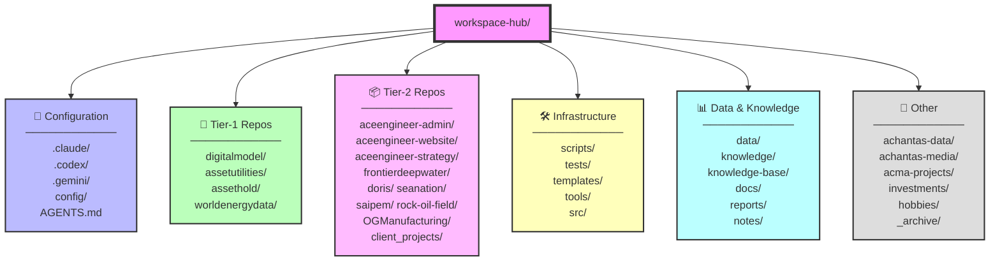
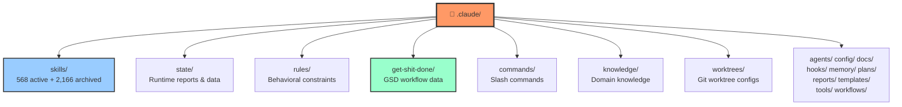
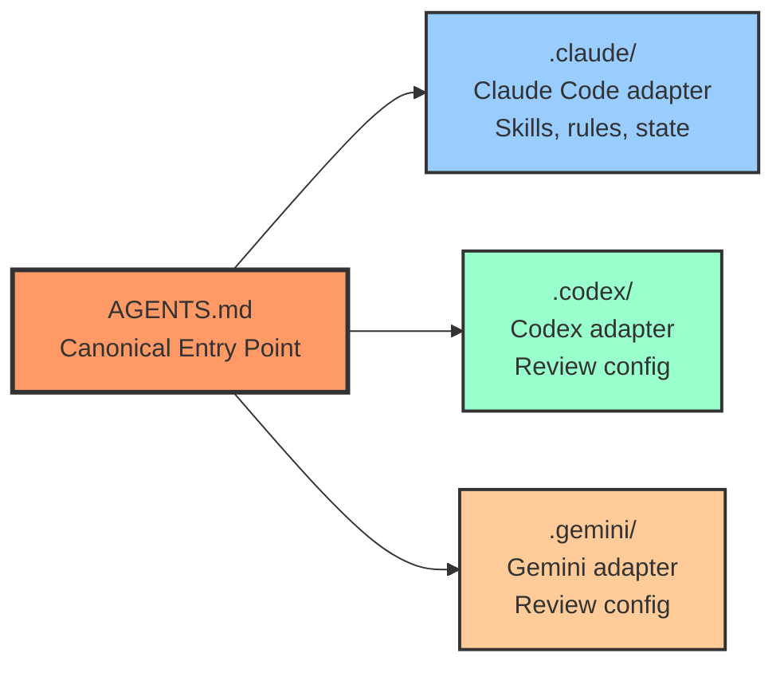
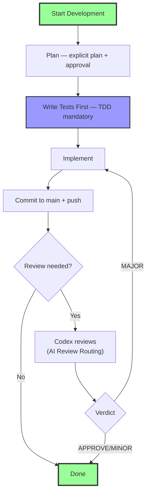

# Workspace Hub File Structure

> **Last Updated:** 2026-04-02
>
> Visual representation of the workspace-hub directory structure.

## Top-Level Directory Structure

## Claude Configuration Structure

## Provider Adapter Model

## Key Directory Purposes

### 📁 Configuration
- **`.claude/`**: Claude Code config — skills, rules, state, GSD workflow
- **`.codex/`**: OpenAI Codex adapter for code review
- **`.gemini/`**: Google Gemini adapter for triggered reviews
- **`config/`**: Central configuration (schedule-tasks.yaml, quality baselines)
- **`AGENTS.md`**: Canonical entry point (Control-Plane Contract)

### 🚀 Tier-1 Repositories (Core Engineering)
- **`digitalmodel/`**: Engineering simulation (OrcaFlex, OrcaWave, FreeCAD)
- **`assetutilities/`**: Shared Python utilities
- **`assethold/`**: Asset management library
- **`worldenergydata/`**: Energy industry data and analysis

### 📦 Tier-2 Repositories (Business & Projects)
- **`aceengineer-admin/`**: Business administration automation
- **`aceengineer-website/`**: Company website (Flask)
- **`aceengineer-strategy/`**: Business strategy
- **`frontierdeepwater/`**: Marine engineering project
- **`doris/`**: Marine domain project
- **`seanation/`**: Drilling domain project
- **`saipem/`**: Construction/engineering domain
- **`rock-oil-field/`**: Oil field analysis
- **`OGManufacturing/`**: Manufacturing domain
- **`client_projects/`**: Client project collection

### 🛠️ Infrastructure
- **`scripts/`**: Automation scripts (quality checks, operations, cron)
- **`tests/`**: Test suites (pytest)
- **`templates/`**: Project templates
- **`tools/`**: Utility tools
- **`src/`**: Workspace-hub Python source

### 📊 Data & Knowledge
- **`data/`**: Shared data files
- **`knowledge/`**: Domain knowledge base
- **`knowledge-base/`**: Structured knowledge
- **`docs/`**: Documentation tree (standards, research, plans, reports)
- **`reports/`**: Generated reports
- **`notes/`**: Working notes

### 📂 Other
- **`achantas-data/`**, **`achantas-media/`**: Personal data/media
- **`acma-projects/`**: ACMA project collection
- **`investments/`**: Investment tracking
- **`hobbies/`**: Personal projects
- **`_archive/`**: Archived content

## Development Workflow

## Notes

- **AGENTS.md** is the canonical entry point — all provider adapters extend it
- **GSD workflow** is the standard task execution framework
- **GitHub Issues** are the single source of truth for task tracking
- **`uv run`** is always used for Python — never bare `python3`
- **Legacy directories** from earlier iterations have been archived — do not extend
- Projects are organized by tier (1-3) based on engineering criticality

This structure enables:
1. **Multi-provider AI** — Claude, Codex, and Gemini work from the same codebase
2. **Skills-based automation** — 568 active skills covering engineering, data, business
3. **Quality enforcement** — automated staleness, drift, and complexity checks
4. **Cron automation** — scheduled tasks via `config/schedule-tasks.yaml`
5. **TDD workflow** — tests before implementation, always
